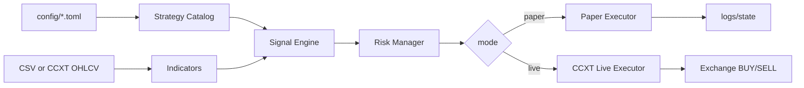

# Crypto Regime Guard Bot

Selectable-strategy crypto trading bot with backtesting, paper trading, and guarded live trading.

> Educational software only. This repo can send real buy/sell orders when explicitly configured, but it does not guarantee profit. Automated crypto trading can lose money quickly.

## What changed from the first version

This repo is no longer just a GitHub repository scanner. It now contains a real trading loop:

1. Choose a strategy in `config/*.toml`.
2. Backtest it on OHLCV data.
3. Run it in paper mode.
4. Turn on live mode only after you set exchange secrets and a risk acknowledgement flag.
5. The bot fetches candles, creates a signal, applies risk gates, then executes BUY/SELL through a CCXT exchange adapter.

## Strategy choices

Change only this line in a config file:

```toml
[bot]
strategy = "regime_guard"
```

Available strategies:

| Name | Style | Intended market | Notes |
|---|---|---|---|
| `regime_guard` | Regime filter + breakout + defensive mean reversion | Mixed markets | Default. Avoids shock/downtrend regimes. |
| `ema_cross` | EMA trend following | Clean trends | Simple and transparent. Can whipsaw in ranges. |
| `donchian_trend` | Breakout trend following | Strong breakouts | Fewer trades; sensitive to false breakouts. |
| `rsi_reversion` | RSI mean reversion | Ranging majors | No averaging down; exits on recovery/shock. |
| `bollinger_breakout` | Volatility breakout | Expansion phases | Requires risk cap and stop discipline. |

## Install

```bash
git clone https://github.com/univcorp2-ctrl/crypto-regime-guard-bot.git
cd crypto-regime-guard-bot
python -m venv .venv
source .venv/bin/activate
pip install -e '.[dev,live]'
pytest
```

## Backtest

```bash
python -m crypto_regime_guard.cli list-strategies
python -m crypto_regime_guard.cli backtest data/sample_btc_usdt_1h.csv --strategy ema_cross
python -m crypto_regime_guard.cli backtest data/sample_btc_usdt_1h.csv --strategy regime_guard --json-output artifacts/backtest.json
```

## Paper trading once

This uses the sample CSV by default, so it works without exchange keys.

```bash
python -m crypto_regime_guard.cli trade --config config/paper.example.toml --once
```

Paper state and trade logs are written under `state/` and `logs/`.

## Live trading

Live mode is guarded by three independent switches:

1. `config/live.example.toml` must use `mode = "live"`.
2. `enable_live_trading = true` must be set in the config.
3. Environment variable `CRYPTO_BOT_LIVE_ACK` must exactly equal `I_UNDERSTAND_THIS_CAN_LOSE_MONEY`.

Example:

```bash
export EXCHANGE_ID=binance
export EXCHANGE_API_KEY='your_key'
export EXCHANGE_API_SECRET='your_secret'
export CRYPTO_BOT_LIVE_ACK='I_UNDERSTAND_THIS_CAN_LOSE_MONEY'
python -m crypto_regime_guard.cli trade --config config/live.example.toml --once
```

Use exchange API keys with withdrawals disabled. Start with tiny size.

## Visual setup guide

Open `docs/setup-visual-guide.md`. It includes a GitHub-rendered setup image and step-by-step beginner flow.

## Main files

- `crypto_regime_guard/strategy.py` — default defensive regime strategy.
- `crypto_regime_guard/classic_strategies.py` — selectable EMA, RSI, Bollinger, Donchian strategies.
- `crypto_regime_guard/strategy_catalog.py` — strategy registry used by CLI/config.
- `crypto_regime_guard/trader.py` — paper/live trading loop.
- `crypto_regime_guard/config.py` — TOML config loader.
- `crypto_regime_guard/risk.py` — order-size and live-trading safety gates.
- `config/paper.example.toml` — safe paper mode.
- `config/live.example.toml` — guarded live mode template.
- `docs/live-trading.md` — live-trading setup and risks.
- `docs/strategy-selection.md` — how to choose a strategy.

## Architecture



## Still included, but no longer central

The GitHub repo scanner remains available as a research helper:

```bash
python -m crypto_regime_guard.cli scan-repos --limit 350
```

It is not the trading engine.

## Production checklist

Before real size live trading:

- Backtest multiple symbols and market regimes.
- Paper trade for several weeks.
- Confirm live exchange minimum order size and fees.
- Disable withdrawals on API keys.
- Use IP restrictions where the exchange supports it.
- Monitor logs and balances.
- Use small fixed order size first.
- Stop the bot after abnormal drawdown.

## License

MIT
