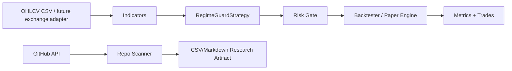

# Crypto Regime Guard Bot

Research-driven, **paper-first** cryptocurrency trading system. It was designed after screening major open-source crypto trading bots and frameworks, with a strong bias toward risk control, reproducible backtests, and not trusting star counts alone.

> Educational software only. This repository does not promise profit. Do not trade live until you understand the code, fees, slippage, exchange risk, API-key risk, and drawdown risk.

## What this repo does

- Runs a deterministic regime-aware strategy on OHLCV CSV data.
- Separates trending, sideways, and shock regimes.
- Uses long-only spot-style exposure by default.
- Includes a backtester with fees, slippage, max drawdown, Sharpe-like metric, win rate, and trade logs.
- Includes a GitHub research scanner that can evaluate 300+ crypto trading bot repos through the GitHub API.
- Produces CI artifacts for sample backtests and research scans.
- Includes docs, tests, devcontainer, and GitHub Actions.

## Why this design

The research favored frameworks with backtesting, dry-run/paper-trading, active maintenance, exchange abstractions, and explicit disclaimers. Freqtrade, Hummingbot, OctoBot, Jesse, OpenTrader, GoCryptoTrader, StockSharp, and Superalgos influenced the architecture. Archived but popular projects such as Gekko and Zenbot are useful historically, but are poor bases for new production work.

The resulting strategy is intentionally conservative:

1. **Trade only when regime is clear.**
2. **Avoid leverage by default.**
3. **Exit or stay flat during shock volatility.**
4. **Use small mean-reversion entries only in sideways markets.**
5. **Never optimize only for win rate; measure drawdown, risk-adjusted return, and turnover.**

## Strategy logic

The default `RegimeGuardStrategy` evaluates each candle using:

- Fast EMA and slow EMA for trend direction.
- Donchian breakout for trend entry.
- Range efficiency to avoid noisy fake trends.
- Rolling z-score for small sideways mean reversion.
- ATR-based shock filter.
- Hard target-position control instead of unlimited averaging down.

Default actions:

| Regime | Condition | Action |
|---|---|---|
| Trend up | close breaks previous Donchian high and volatility is acceptable | target long exposure |
| Trend up but weakening | close falls below slow EMA or Donchian low | exit |
| Sideways | z-score deeply negative, no shock | small long exposure |
| Sideways recovery | z-score normalizes | exit |
| Trend down or shock | risk filter active | flat |

## Quick start

```bash
python -m venv .venv
source .venv/bin/activate
pip install -e '.[dev]'
pytest
python -m crypto_regime_guard.cli backtest data/sample_btc_usdt_1h.csv --initial-cash 10000
```

The command writes a readable summary to stdout. GitHub Actions also uploads sample backtest output as an artifact.

## Scan 300+ GitHub repositories

The scanner uses GitHub Search API and scores repos by stars, forks, recency, license, archive status, suspicious keywords, and trading-bot relevance.

```bash
GITHUB_TOKEN=ghp_xxx python -m crypto_regime_guard.cli scan-repos \
  --limit 350 \
  --output artifacts/repo-evaluation.csv \
  --markdown artifacts/repo-evaluation.md
```

Without a token, the public API rate limit may be too low for 300+ repositories. In GitHub Actions, the included `research.yml` workflow uses `${{ github.token }}` automatically.

## Find and integrate your existing repos

Run the research workflow with `include_owner_repos=true`. It will also query repositories owned by the workflow owner and merge likely `crypto`, `trading`, `bot`, `freqtrade`, `hummingbot`, or `backtest` repositories into the evaluation output.

## Main files

- `crypto_regime_guard/strategy.py` — clear trading logic.
- `crypto_regime_guard/backtest.py` — deterministic backtester.
- `crypto_regime_guard/scanner.py` — GitHub 300+ repo evaluator.
- `docs/research/research-summary.md` — research conclusions.
- `docs/research/repo-evaluation-seed.csv` — manually verified seed evaluation from current web research.
- `.github/workflows/ci.yml` — tests, lint, sample backtest artifact.
- `.github/workflows/research.yml` — 300+ repo scan artifact.

## Production requirements

Live trading is intentionally not enabled in the initial version. To go live safely, add and review:

- Exchange adapter with read-only dry-run first.
- Secrets: `EXCHANGE_API_KEY`, `EXCHANGE_API_SECRET`, optional `EXCHANGE_API_PASSPHRASE`.
- API keys with withdrawals disabled.
- Per-exchange order-size, tick-size, rate-limit, and outage handling.
- Paper-trading burn-in period.
- Monitoring, kill switch, and alerting.
- Walk-forward tests and out-of-sample evaluation.

## Architecture



## License

MIT
