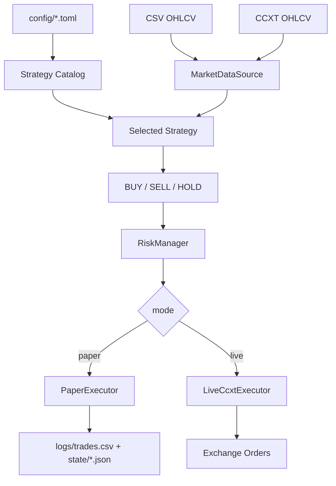

# Architecture

Crypto Regime Guard is now a selectable-strategy trading bot with three execution levels:

1. Backtest.
2. Paper trading.
3. Guarded live trading through CCXT.

## Components

## Strategy registry

`crypto_regime_guard/strategy_catalog.py` maps config names to strategy classes:

- `regime_guard`
- `ema_cross`
- `donchian_trend`
- `rsi_reversion`
- `bollinger_breakout`

The CLI and trading engine both call `build_strategy(config.strategy, config.strategy_params)`.

## Trading loop

`TradingEngine.run_once()` does this:

1. Load candles from CSV or CCXT.
2. Generate signals from the selected strategy.
3. Take the latest signal.
4. Apply risk checks.
5. Execute paper fill or live CCXT market order.
6. Return a structured JSON-like result.

## Live trading guardrails

Live trading requires:

- `mode = "live"`
- `enable_live_trading = true`
- `EXCHANGE_API_KEY`
- `EXCHANGE_API_SECRET`
- `CRYPTO_BOT_LIVE_ACK = I_UNDERSTAND_THIS_CAN_LOSE_MONEY`

The default config keeps order size small and blocks high risk-score trades.

## Why this logic

The bot favors strategies that can be explained and audited. Instead of pretending one magic model always wins, it gives users strategy choices and makes every decision visible through `Signal.reason`.

The default `regime_guard` strategy remains the conservative recommendation because it tries to avoid the worst failure mode of simple bots: trading aggressively during shock volatility or downtrends.
