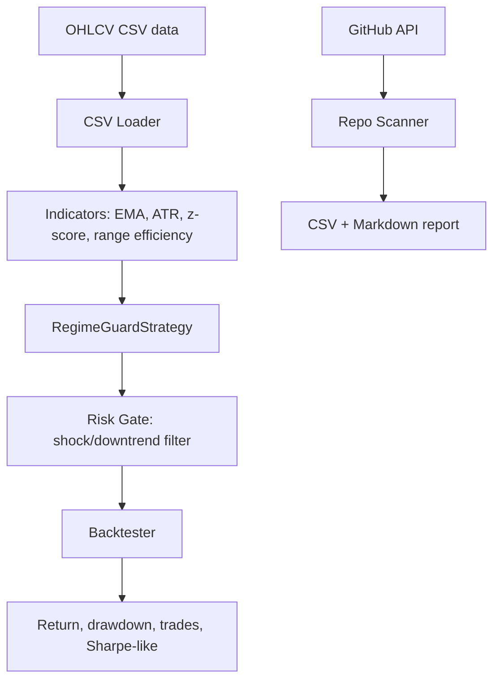
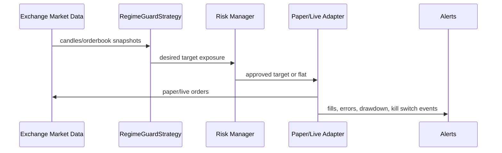

# Architecture

Crypto Regime Guard is a paper-first research and backtesting system. It is intentionally smaller than full frameworks such as Freqtrade or Hummingbot, but it borrows their best operational ideas: dry-run first, explicit risk controls, reproducibility, and auditable strategy code.

## Components

## Trading logic boundary

The strategy emits target exposure only. It does not directly place exchange orders. This makes the first release suitable for research, paper trading, CI tests, and review. A future exchange adapter should consume target exposure and be responsible for tick size, minimum notional, rate limit, order idempotency, and kill switches.

## Data flow

1. `load_candles_csv()` validates OHLCV rows.
2. Indicators calculate trend, volatility, and noise state.
3. `RegimeGuardStrategy.generate_signals()` classifies each candle.
4. `Backtester.run()` converts target exposure into simulated trades with fees and slippage.
5. Metrics are written to stdout or JSON artifacts.

## Risk controls

- Long-only by default.
- Flat during downtrend and shock regimes.
- ATR-based volatility guard.
- No martingale and no unlimited DCA.
- Position target is capped by configuration.

## GitHub research scanner

The scanner is separate from the trading engine. It uses GitHub Search API queries and scores repositories by:

- stars and forks,
- recent push date,
- archive status,
- license presence,
- trading-bot relevance,
- suspicious keywords such as hack, cheat, crack, private-key, sniper.

The scanner can include owner repositories when `--include-owner-repos` is passed and a `GITHUB_TOKEN` is present.

## Future production architecture

Production should add exchange-specific adapters, monitoring, persistent state, and canary paper trading before any live order is enabled.
