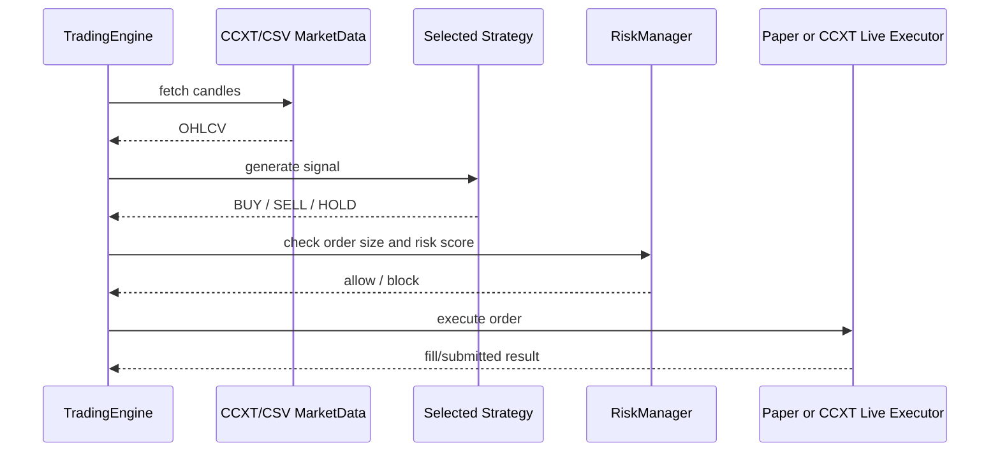

# Live Trading Guide

このリポジトリはCCXT経由で実際にBUY/SELLを送れる設計です。ただし、初期状態ではライブ売買は安全ロックされています。

## ライブ売買が動く条件

3つすべて必要です。

```toml
[bot]
mode = "live"
enable_live_trading = true
```

```bash
export EXCHANGE_API_KEY='your_key'
export EXCHANGE_API_SECRET='your_secret'
export CRYPTO_BOT_LIVE_ACK='I_UNDERSTAND_THIS_CAN_LOSE_MONEY'
```

実行:

```bash
python -m crypto_regime_guard.cli trade --config config/live.example.toml --once
```

## 取引の流れ



## APIキーの安全設定

- 出金権限は付けない。
- 可能ならIP制限を使う。
- 最初は小額にする。
- `max_single_trade_quote` を小さくする。
- 取引所の最小注文サイズを確認する。

## ライブモードの実装

`crypto_regime_guard/trader.py` の `LiveCcxtExecutor` が実注文を出します。

- BUY: `create_market_buy_order(symbol, amount)`
- SELL: `fetch_balance()` でbase asset残高を確認し、`create_market_sell_order(symbol, base_free)`

## よくある失敗

### 1. `Install live dependencies first`

`ccxt` が入っていません。

```bash
pip install -e '.[live]'
```

### 2. `CRYPTO_BOT_LIVE_ACK is not set correctly`

ライブ売買の同意フラグがありません。

```bash
export CRYPTO_BOT_LIVE_ACK='I_UNDERSTAND_THIS_CAN_LOSE_MONEY'
```

### 3. 注文が小さすぎて失敗

取引所の最小注文額を下回っている可能性があります。`quote_order_size` と `max_single_trade_quote` を確認してください。

## 本番で必要な追加改善

- 指値注文対応
- 損切り注文・OCO注文
- 複数銘柄対応
- SQLiteでの永続ポジション管理
- Telegram/Discord通知
- Docker常駐運用
- 取引所別の最小数量・数量丸め
