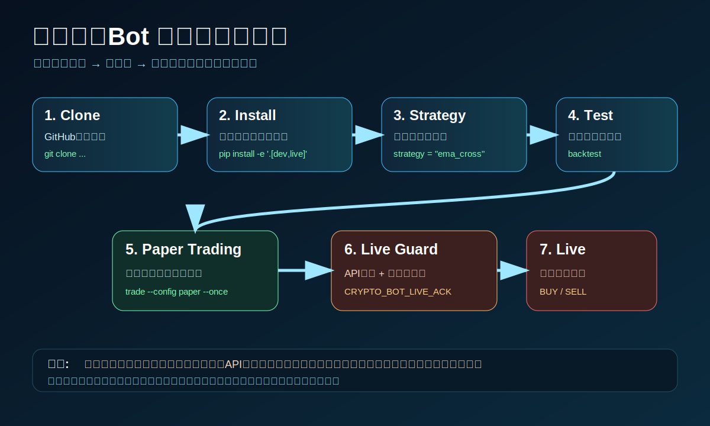

# 初期導入ガイド（画像つき）

このリポジトリは、初心者でも `clone → install → backtest → paper → live` の順で進められるように構成しています。



## 1. リポジトリを開く

```bash
git clone https://github.com/univcorp2-ctrl/crypto-regime-guard-bot.git
cd crypto-regime-guard-bot
```

## 2. Python環境を作る

```bash
python -m venv .venv
source .venv/bin/activate
```

Windows PowerShellの場合:

```powershell
python -m venv .venv
.\.venv\Scripts\Activate.ps1
```

## 3. インストールする

```bash
pip install -e '.[dev,live]'
pytest
```

## 4. 戦略を選ぶ

```bash
python -m crypto_regime_guard.cli list-strategies
```

設定ファイルのこの行を変更します。

```toml
strategy = "regime_guard"
```

候補:

- `regime_guard`
- `ema_cross`
- `donchian_trend`
- `rsi_reversion`
- `bollinger_breakout`

## 5. バックテストする

```bash
python -m crypto_regime_guard.cli backtest data/sample_btc_usdt_1h.csv --strategy ema_cross
```

## 6. 紙取引で1回だけ動かす

```bash
python -m crypto_regime_guard.cli trade --config config/paper.example.toml --once
```

## 7. 本番売買の前に確認する

本番売買は `docs/live-trading.md` を読んでからにしてください。`mode = "live"` だけでは動かず、環境変数の同意フラグとAPIキーが必要です。

```bash
export EXCHANGE_ID=binance
export EXCHANGE_API_KEY='your_key'
export EXCHANGE_API_SECRET='your_secret'
export CRYPTO_BOT_LIVE_ACK='I_UNDERSTAND_THIS_CAN_LOSE_MONEY'
python -m crypto_regime_guard.cli trade --config config/live.example.toml --once
```
